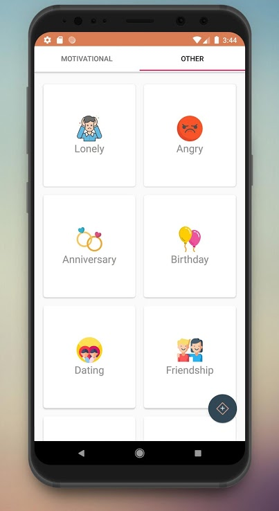
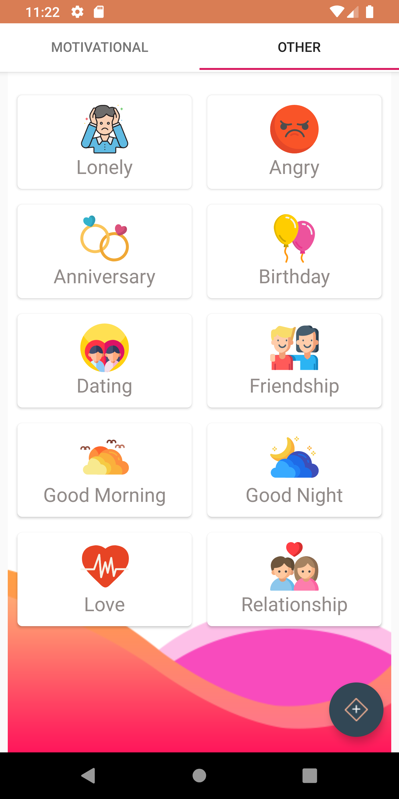

# Best-Quotes

The Best-Quotes app is a mobile platform where users can find various quotes under different categories. People can open this app and get their daily dose of motivation or use the app to communicate to loved ones how they feel at any given time of the day. 

Other than motivational quotes, quotes are available under categories such as, Anniversary, Birthday, Dating, Friendship, Love, Relationship, Anger, Loneliness, Good Morning and Good night quotes.

Users can download the quotes in the app and even share them with their beloved. They also can create brand new quotes to the heart’s content and use different fonts, font colors, font sizes, background images or colors to decorate them and share with people or download the freshly created quotes.

## screenshots

 

## Feature of Application
### Splash Screen

Animated view

   

### Main Screen

It is included mortivational quotes in main page. Also added floating action button to create quote

### Create Quote

added gif for view create quote function

### Other Quotes

### Sub Category view

### Image viewer

  

### Photo editor SDK view

 those screen change as above screen. because of this sdk not suataible to use as exsist..

  

